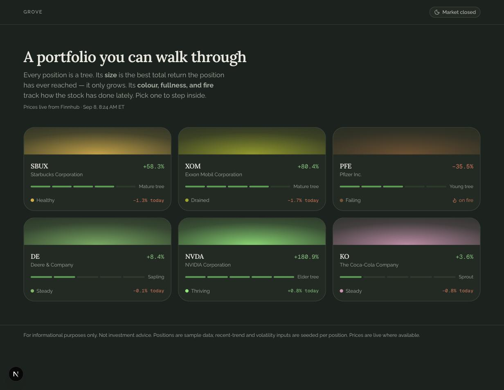
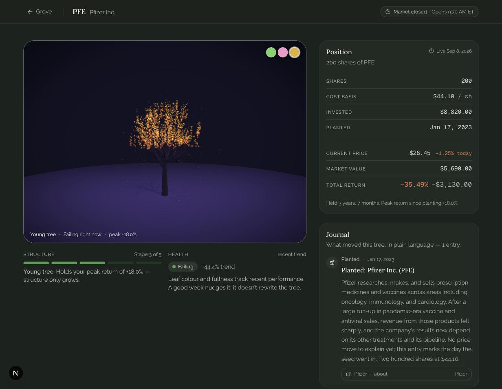
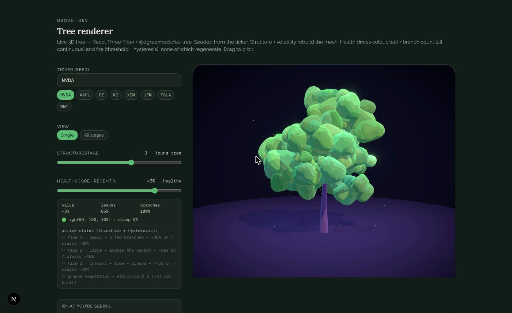

# Grove

**A portfolio you can walk through.** Every stock position is a procedurally
generated 3D tree. The tree's *size* is the best total return the position has
ever reached — it only grows. Its *colour, fullness, and fire* track how the
stock has done lately.

🌲 **Live demo:** _add your Vercel URL here_



---

## The idea

Most portfolio tools give you a number that goes up and down. Grove splits a
position into two things that move independently, the way a real tree does:

| Channel | Driven by | What it does |
|---|---|---|
| **Structure** — trunk, branches, canopy size | Peak total return since you bought | Only ever grows. A stock that doubled and gave half back is a *big tree that's currently sick*, not a small one. |
| **Health** — leaf colour, density, droop, fire | Recent performance | Fast and volatile. A good week nudges the colour; it doesn't rewrite the tree. |

So the shape of the object is the history of the position, and the colour is the
present. A drawdown makes branches die back from the tips and the canopy yellow
and thin; a severe one sets the tree on fire until the stock recovers past the
level that lit it.



### Mapping, precisely

- **Structure stage** (Seed → Sprout → Sapling → Young → Mature → Elder) from
  peak total return: `<5% · 5–15% · 15–40% · 40–100% · 100%+`.
- **Branch count** within a stage tracks health continuously — branches recede
  from the tips as the stock declines and return on recovery, without
  regenerating the tree.
- **Leaf colour / density / droop** interpolate continuously in OKLCH along a
  per-skin ramp. No discrete steps.
- **Fire** is the one threshold, with hysteresis so it can't strobe:
  tier 1 at −35% (clears −30%), tier 2 at −50% (−45%), tier 3 at −75% (−70%).
  Burning foliage chars to blackened remnants; bark darkens.
- Trees are **seeded by a hash of the ticker** — `NVDA` is the same tree on
  every reload and every machine. Only structure stage and (bucketed)
  volatility rebuild the mesh; health, fire and skin are material and
  particle overlays.

---

## Data

- **Positions** are curated demo data (`src/lib/positions.ts`) — six holdings
  chosen to spread the grove across every structure stage and health state,
  each with one authored "what this company does" journal note.
- **Current price and today's move** are **live from [Finnhub](https://finnhub.io)**,
  fetched server-side, batched across all tickers, cached 60s while the market
  is open / 15 min when closed. The API key is read only on the server and never
  reaches the browser. Also exposed at `GET /api/quote?symbols=DE,NVDA`.
- **Total return** is real — computed from the live price and the position's
  cost basis. **Peak return, the recent-trend percent, and volatility are
  seeded** per position: the Finnhub free tier has no historical candles, so
  those can't be derived. This is stated in the app's footer.
- No live price is ever faked. If the key is missing or the request fails, each
  tree falls back to a dated reference price with a visible "prices as of" note.

---

## Tuning playground

`/dev/tree` renders one tree with live sliders for structure stage and health
score, a skin picker, an all-stages grid, and a plain-language readout of what
the tree is showing and why. It's how the visual system was dialled in.



---

## Stack

- **Next.js 16** (App Router, Turbopack) · React 19 · TypeScript
- **Tailwind CSS v4** · shadcn/ui
- **React Three Fiber** · drei · `@react-three/postprocessing` · Three.js
- **[`@dgreenheck/ez-tree`](https://github.com/dgreenheck/ez-tree)** for the
  procedural branch/leaf geometry
- **Finnhub** for quotes · deployed on **Vercel**

No database, no accounts, no analytics.

---

## Run it locally

```bash
git clone https://github.com/<you>/grove.git
cd grove
npm install

cp .env.example .env.local
# add a free key from https://finnhub.io/dashboard — optional; without it the
# app runs on each position's reference price.

npm run dev          # http://localhost:3000
```

`npm run build` for a production build. Deploy to Vercel and set
`FINNHUB_API_KEY` in the project's environment variables.

---

## Scope

Grove is the **visual core** of a larger design (see [`SPEC.md`](SPEC.md)).
Built: the two-channel tree system, seeded procedural rendering, fire, three
leaf skins, live quotes, the forest and tree views, an accessibility text layer.
Designed but not built: an add/sell flow with local persistence, an LLM journal
engine that explains price moves from company news under hard honesty
constraints, real price history + a growth time-lapse, discrete event visuals
(dividend fruit, earnings blossoms, split forks), and a full weather/day-night
forest environment.

---

*For informational purposes only. Not investment advice. Grove reads market data
and displays it — it never places trades and never recommends buying or selling.*
